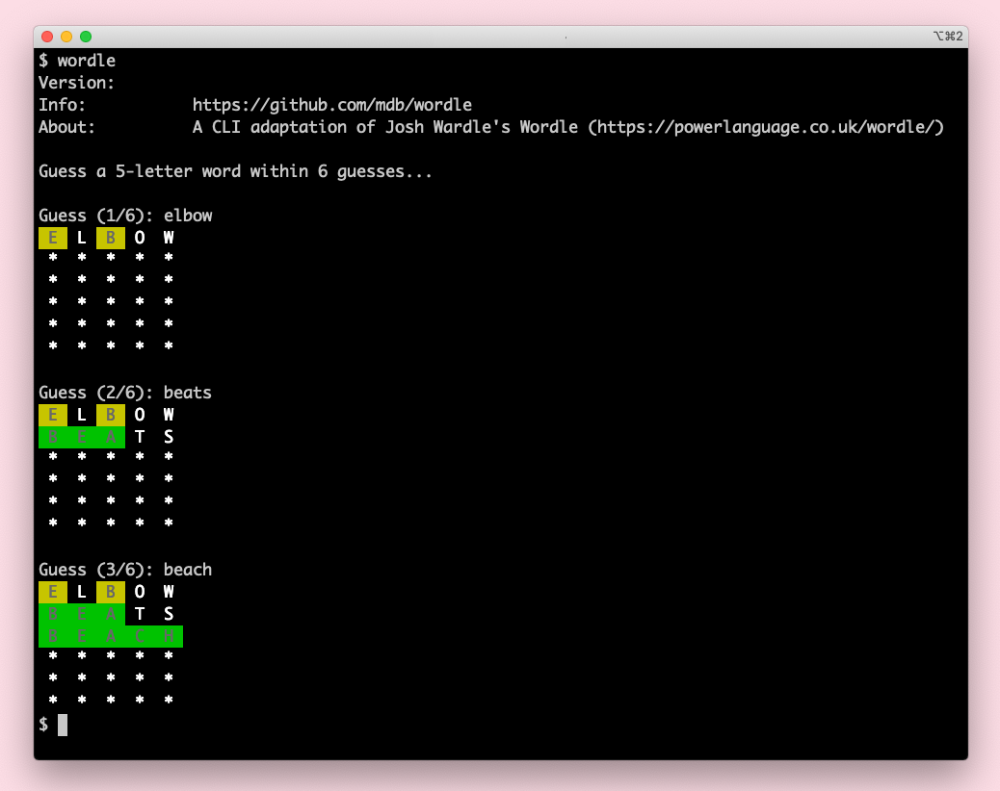

[](https://github.com/mdb/wordle/actions/workflows/main.yml)

# wordle

A Go-based CLI implementation of [Josh Wardle](https://powerlanguage.co.uk)'s [Wordle](https://powerlanguage.co.uk/wordle/).

**Spoiler alert**: `words/words.txt` lists the solutions.



## Installation

### Mac OS

Mac OS [homebrew](https://brew.sh/) users:

```
brew tap mdb/homebrew-repo
brew install wordle
```

### Linux, Windows, and Mac OS users not using `homebrew`

Download the [latest release](https://github.com/mdb/wordle/releases) for your platform.

### Compile from source

Alternatively, you can compile from source:

```
make
```

...and run the compiled `wordle` for your platform:

```
dist/wordle_darwin_amd64/wordle
Version:        0.0.1
Info:           https://github.com/mdb/wordle
About:          A CLI adaptation of Josh Wardle's Wordle (https://powerlanguage.co.uk/wordle/)

Guess a 5-letter word within 6 guesses...

Guess (1/6):
```

## Development

Run tests and compile `wordle` release artifacts:

```
make
```

## Improvement ideas

* Could https://github.com/rivo/tview enable some UI improvements? Or is that overkill?
* Is there a way to output a keyboard visualization with color-coded letters after each guess, similar to https://powerlanguage.co.uk/wordle/?
* Would it be cool to provide an option to output the final grid as an image, such that it could be shared?
* Would it be cool to provide an option to output stats?
* Would it be cool to restrict game play to once/day?
* Should there be a `-practice` flag to support `-practice` mode? If so, should it use old solutions or perhaps https://raw.githubusercontent.com/dwyl/english-words/master/words_alpha.txt ?
* Should there be a `-hard` flag to support a hard mode?
* Could `wordle` support configurable backends -- like `git` -- for persisting stats and current state?
* Should `wordle` display a "Not in word list" message, similar to real Wordle?
